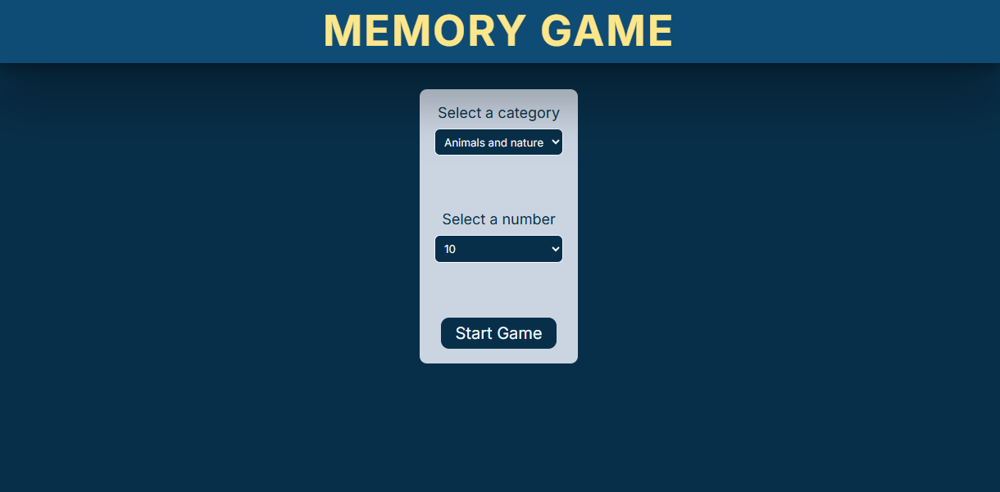

# React Memory Game
A classic memory card matching game built with React and Next.js. Test your memory skills by flipping cards and finding matching pairs!

## See live demo [here](https://react-memory-game-jade-eight.vercel.app/) !



## Game Features

* Card Matching: Flip cards to find matching pairs
* Modern UI: Clean and intuitive user interface
* Mobile Friendly: Fully responsive design for all devices
* Basic accessibility support: focus management on form mount, semantic HTML elements, and assistive descriptions for screen readers

##  Tech Stacks
- React + Next.js 13+ (app router)
- Zustand for global game state
- Hooks for modular game logic/plugins
- DOMPurify for XSS-safe rendering
- TypeScript for type safety

##  How to Run Locally
### Prerequisites
Make sure you have Node.js installed on your machine (version 14 or higher).
Installation

### Clone the repository:

```bash
git clone https://github.com/yy933/React-memory-game.git
cd React-memory-game
```

### Install dependencies:

```bash
npm install
# or
yarn install
# or
pnpm install
```

### Run the development server:

```bash
npm run dev
# or
yarn dev
# or
pnpm dev
```

### Open http://localhost:3000 in your browser to play the game.

## Project Structure
```
src/
├── app/
│   ├── data              # Game options data
│   ├── page.tsx          # Main game page
│   ├── layout.tsx        # Root layout
│   └── globals.css       # Global styles
│
├── components/
│   ├── MemoryCardList.tsx   # Renders all cards
│   ├── MemoryCardItem.tsx   # Single card (memoized)
│   └── Other reusable React components
│
├── hooks/
│   ├── useGameLogic.ts      # Load emojis, reset and start game
│   └── useMatchingLogic.ts  # Card matching logic
│
├── services/
│   └── emojiService.ts      # Fetch + cache logic
│   
├── stores/
│   └── useEmojiStore.ts     # Zustand state management
│
├── types/
│   └── index.ts             # TypeScript definitions
│
└── utils/
    └── getRandomSample.ts   # Sampling & shuffle logic
```


## To-Do / Future Enhancements
- Add loading spinner when fetching emojis
- Show user-friendly errors for network issues
- Add unit tests for RNG, matching logic, and undo/redo
- Implement high scores using localStorage or backend
- Add restart modal or fullscreen mode for better UX
- Improve UI styling for a more polished, responsive, and accessible interface


## License
MIT License
